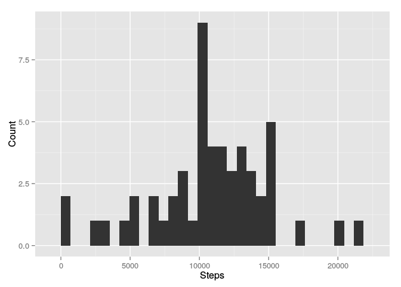
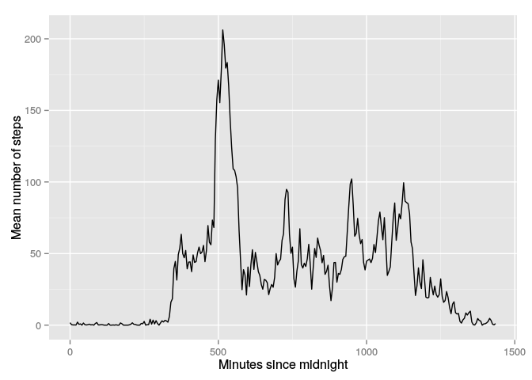
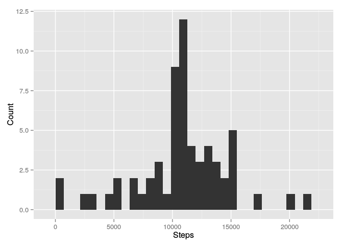
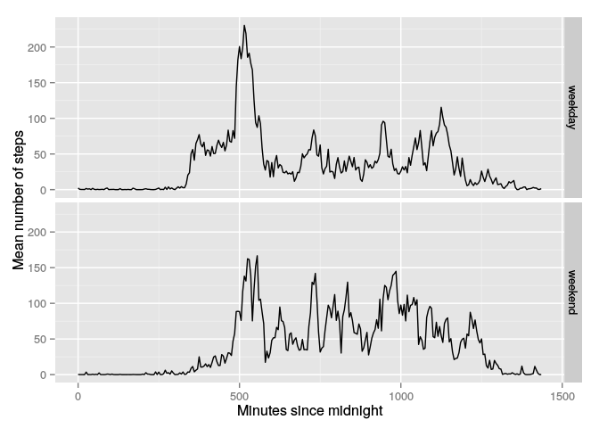

# Reproducible Research: Peer Assessment 1

## Prerequisites

This assessment makes use of the [data.table](https://cran.r-project.org/web/packages/data.table/index.html) and [dplyr](https://cran.r-project.org/web/packages/dplyr/index.html) and [ggplot2](https://cran.r-project.org/web/packages/ggplot2/index.html) packages. Ensure they are installed (via `install.packages(c("data.table", "dplyr", "ggplot2"))`) before running any of the code here. data.table is probably overkill for the small data set we're looking at here, but it's invaluable for large data sets and I like to have a consistent set of tools to work with.


```r
library(data.table)
library(dplyr)
```

```
## 
## Attaching package: 'dplyr'
## 
## The following objects are masked from 'package:data.table':
## 
##     between, last
## 
## The following objects are masked from 'package:stats':
## 
##     filter, lag
## 
## The following objects are masked from 'package:base':
## 
##     intersect, setdiff, setequal, union
```

```r
library(ggplot2)
```

We also assume that the data has already been unzipped and is available in the working directory as `activity.csv`.

## Loading and preprocessing the data

Load in the data; we perform two bits of preprocessing along the way:

1. Changing the `date` column into an actual date as we go
2. Changing the `interval` column into a simple number of minutes since midnight, rather than the original HHMM format. (`%/%` is the integer division operator and `%%` is the modulus operator)


```r
steps <- fread("activity.csv") %>%
  mutate(date = as.POSIXct(date)) %>%
  mutate(interval = 60 * (interval %/% 100) + interval %% 100)
```

Note that this transformation on the `interval` column means that the graphs here (in particular that in the weekdays/weekend section) have a quantative difference from that presented in the example as they don't have the "gaps" seen in the example - the gaps in the example are caused by the jump from (e.g.) 855 to 900, whereas my data simply goes from 535 to 540 at that point. I'd strongly argue that my graphs are more correct than the example graphs, as it makes little sense to plot a line graph where those gaps don't have any physical meaning.

## What is mean total number of steps taken per day?

Group the data by day and sum the number of steps:


```r
stepsByDay <- steps %>% group_by(date) %>% summarise(steps = sum(steps))
qplot(stepsByDay$steps, geom="histogram", xlab="Steps", ylab="Count")
```

```
## stat_bin: binwidth defaulted to range/30. Use 'binwidth = x' to adjust this.
```

 

And calculate the mean and median, ignoring missing values:


```r
mean(stepsByDay$steps, na.rm = TRUE)
```

```
## [1] 10766.19
```

```r
median(stepsByDay$steps, na.rm = TRUE)
```

```
## [1] 10765
```

## What is the average daily activity pattern?

Group the data by 5 minute interval and calculate the mean number of steps, again ignoring missing values:


```r
stepsByInterval <- steps %>% group_by(interval) %>%
  summarise(steps = mean(steps, na.rm = TRUE))
qplot(stepsByInterval$interval, stepsByInterval$steps, geom = "line",
  xlab = "Minutes since midnight", ylab = "Mean number of steps")
```

 

(The `sort` isn't needed here, but is for use later on when we impute missing values).

Find the row which contains the highest mean number of steps, and take the interval. This is the number of minutes since midnight, so convert it back into hours and minutes (again using the integer division and modulus operators).


```r
maxSteps <- (stepsByInterval %>% filter(steps == max(steps)))$interval
maxStepsHours <- maxSteps %/% 60
maxStepsMinutes <- maxSteps %% 60
```

The five minute interval which contains the highest mean number of steps is that starting at 8:35.

## Imputing missing values

The number of missing `steps` values is:


```r
sum(is.na(steps$steps))
```

```
## [1] 2304
```

For avoidance of doubt, there are no missing `date` or `interval` values:


```r
sum(is.na(steps$date))
```

```
## [1] 0
```

```r
sum(is.na(steps$interval))
```

```
## [1] 0
```

We'll impute the missing `steps` values by taking the mean for that 5 minute interval across all other days:


```r
imputedSteps <- steps %>%
  mutate(steps = ifelse(is.na(steps), stepsByInterval[interval / 5 + 1]$steps, steps))
```

Perform the same analysis as in the "What is mean total number of steps taken per day?" section:


```r
imputedStepsByDay <- imputedSteps %>% group_by(date) %>% summarise(steps = sum(steps))
qplot(imputedStepsByDay$steps, geom="histogram", xlab="Steps", ylab="Count")
```

```
## stat_bin: binwidth defaulted to range/30. Use 'binwidth = x' to adjust this.
```

 

```r
mean(imputedStepsByDay$steps)
```

```
## [1] 10766.19
```

```r
median(imputedStepsByDay$steps)
```

```
## [1] 10766.19
```

The mean has not changed; this is because the missing values for `steps` occur for whole day-long blocks, so we have simply replaced days by the mean value. That it is day-long blocks which are missing can been seen from the fact that there are only 8 dates with missing values, and 2304 = 8 * (60 * 24 / 5) missing `steps` values:


```r
length(unique(steps[is.na(steps)]$date))
```

```
## [1] 8
```

The median has become equal to the mean; this is because we have created those 8 days with precisely the same values for `steps`, and it happens that the median falls in those days.

## Are there differences in activity patterns between weekdays and weekends?

Implementation note: the `weekdays` function is a *really bad* idea to use here, whatever the notes may say - the biggest problem is that it's locale dependent, so you get different values if you're in the UK or if you're in France. It's *much* better to use the `POSIXlt` type instead, so I'm doing that.


```r
stepsByIntervalAndDayType <-
  imputedSteps %>%
  mutate(dayType = ifelse(as.POSIXlt(date)$wday %in% c(0, 6), "weekend", "weekday")) %>%
  group_by(dayType, interval) %>%
  summarise(steps = mean(steps))
qplot(data = stepsByIntervalAndDayType, x = interval, y = steps, geom = "line",
  xlab = "Minutes since midnight", ylab = "Mean number of steps") +
  facet_grid(dayType ~ .)
```

 


